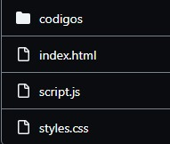
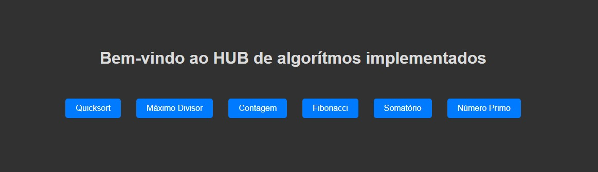

# ENTREGÁVEL 2

## Descrição

Este projeto apresenta uma implementação com interface Web (Front-end) para acessar e executar os algoritmos implementados

## Funcionalidades

- Executar 6 diferentes códigos em 2 linguagens cada
- Verificação de entrada válida.

## Pré-requisitos

- Download de todos os arquivos para sua máquina

## Como usar

1. Faça o download de todos os arquivos presentes:
   

2. Abra o index principal
   

3. Aproveite o código xD
   

## Contribuições

Contribuições são bem-vindas! Sinta-se à vontade para abrir um pull request ou uma issue se encontrar algum problema ou tiver sugestões para melhorias.
