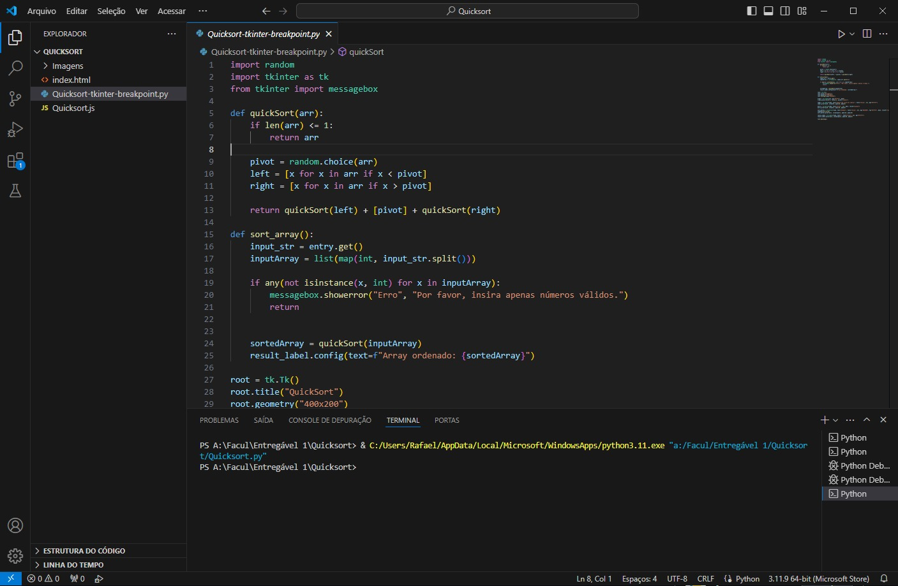
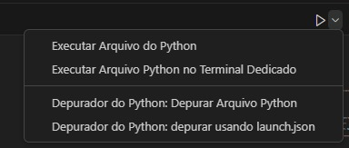
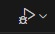

# QuickSort

Um simples visualizador de algoritmo de ordenação QuickSort implementado em Python utilizando Tkinter para a interface gráfica.

## Descrição

Este projeto apresenta uma implementação do algoritmo de ordenação QuickSort em Python, acompanhada de uma interface gráfica simples desenvolvida com Tkinter. O usuário pode inserir uma lista de números através de uma entrada e clicar em um botão para visualizar a lista ordenada pelo QuickSort.

## Funcionalidades

- Entrada de lista de números para ordenação.
- Verificação de entrada válida.
- Exibição da lista ordenada após a ordenação.

## Pré-requisitos

- Python 3.x
- Tkinter (normalmente incluído na instalação padrão do Python)

## Como usar

1. Abra o código "Quicksort-tkinter-breakpoint.py" com o VSCode:
   

2. Altere a opção de depuração:
   

3. Símbolo correto do Debug:
   

4. Breakpoint adicionado na linha 13:
   

5. Tkinter abrindo:
   

## Contribuições

Contribuições são bem-vindas! Sinta-se à vontade para abrir um pull request ou uma issue se encontrar algum problema ou tiver sugestões para melhorias.
